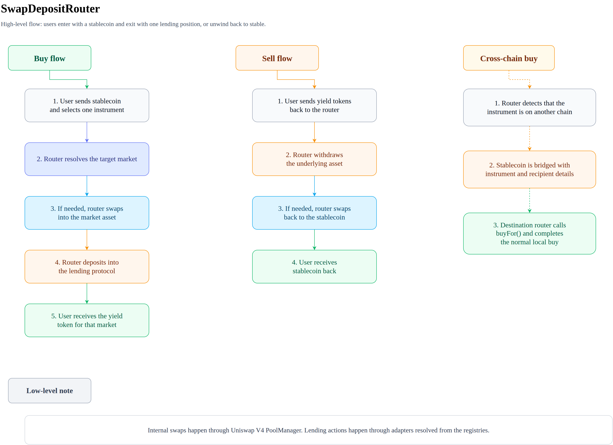
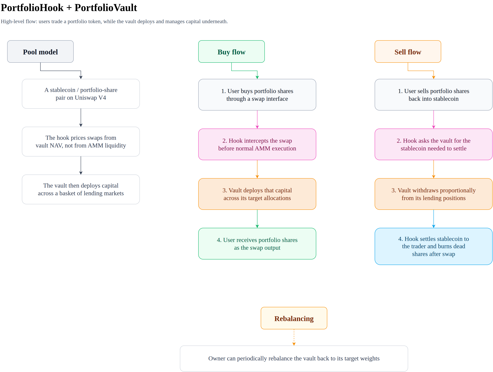
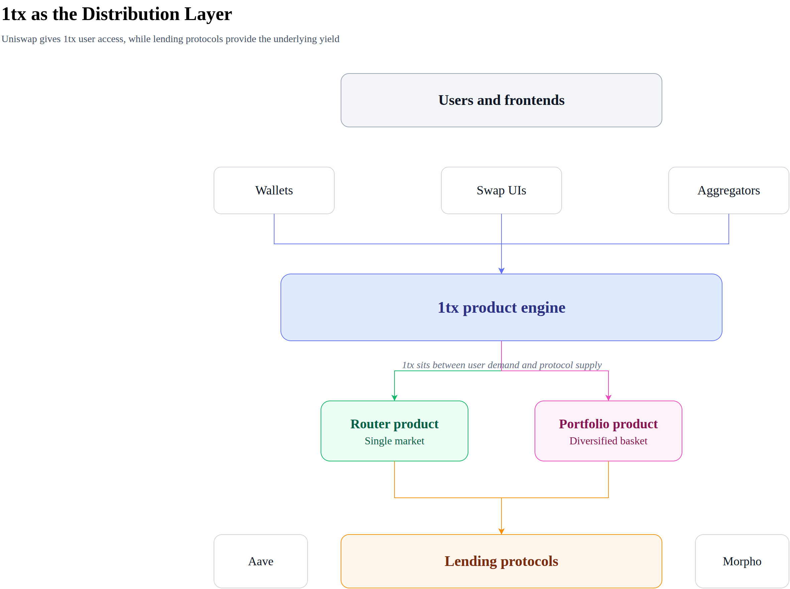
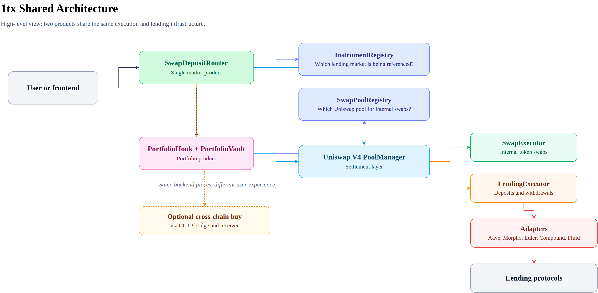

# 1tx

Lending positions as swappable products on Uniswap V4.

Instead of navigating individual lending protocols, bridging tokens, and managing deposits manually, 1tx packages that work into a swap experience distributed through Uniswap V4.

## Products

### SwapDepositRouter

Buy or sell a single lending position in one transaction. User sends USDC, receives yield-bearing tokens. Token swaps happen automatically if the target market uses a different underlying asset.



### PortfolioHook + PortfolioVault

Buy or sell a diversified lending portfolio through a Uniswap V4 pool. Each portfolio is a zero-liquidity pool where the hook intercepts swaps, deploys capital across lending protocols by target weights, and settles at NAV.



## Why Uniswap Distribution

A Uniswap pool is a distribution channel. Every frontend that supports swaps becomes a point of sale for yield products — no custom UI needed.



## Deployed Chains

| Chain | Chain ID | Explorer |
|-------|----------|----------|
| Arbitrum | 42161 | [arbiscan.io](https://arbiscan.io) |
| Base | 8453 | [basescan.org](https://basescan.org) |
| Unichain | 130 | [uniscan.xyz](https://uniscan.xyz) |

See [docs/deployments.md](docs/deployments.md) for full contract addresses, instrument IDs, and configuration.

## Supported Protocols

| Protocol | Adapter | Chains |
|----------|---------|--------|
| Aave V3 | `AaveAdapter` | Arbitrum, Base |
| Morpho Vaults | `MorphoAdapter` | Arbitrum, Base, Unichain |
| Euler Earn | `EulerAdapter` | Arbitrum, Base, Unichain |
| Compound V3 | `CompoundAdapter` | Base |
| Fluid | `FluidAdapter` | Base |

All adapters implement `ILendingAdapter` with a unified interface: `deposit()`, `withdraw()`, `getYieldToken()`, `getMarketCurrency()`.

## Partner Integrations

### Uniswap

Uniswap V4 is the core infrastructure layer for 1tx. Both products depend on it:

- **SwapDepositRouter** uses Uniswap V4 PoolManager for internal token swaps between stablecoins and lending market assets.
- **PortfolioHook** is a native Uniswap V4 hook — portfolio shares are bought and sold as swaps through zero-liquidity Uniswap pools, with pricing driven by vault NAV rather than AMM liquidity.
- Every Uniswap-compatible frontend (wallets, aggregators, swap UIs) automatically becomes a distribution point for 1tx yield products.

### Unichain

Unichain is used as a deployment target for instruments and portfolio strategies:

| Component | What's deployed |
|-----------|----------------|
| Instruments | Morpho (Gauntlet USDC-C) and Euler (eeUSDC) vaults |
| Portfolio infra | PortfolioStrategy, PortfolioFactory, PortfolioFactoryHelper |
| Cross-chain | CCTP bridge and receiver for Arbitrum ↔ Base ↔ Unichain routing |

No other partner integrations at this time.

## Architecture



Both products share the same execution building blocks:

- **InstrumentRegistry** — resolves instrument IDs to `(adapter, marketId)` pairs. IDs embed chain identity for cross-chain routing.
- **SwapPoolRegistry** — resolves directional token pairs to Uniswap V4 PoolKeys.
- **SwapExecutor** — reusable V4 swap settlement logic (`sync`, `settle`, `take`).
- **LendingExecutor** — reusable adapter interaction logic for deposits and withdrawals.

The key design insight: `SwapDepositRouter` enters PoolManager context via `unlock()` → `unlockCallback()`, while `PortfolioHook` is already inside that context via `beforeSwap()`. Both call the same libraries.

Cross-chain buys are supported via CCTP bridge adapters (Arbitrum ↔ Base ↔ Unichain).

See [docs/architecture.md](docs/architecture.md) for the full technical breakdown.

## Project Structure

```
src/
  SwapDepositRouter.sol           # Buy/sell router for single instruments
  CCTPBridge.sol                  # Cross-chain bridge via CCTP
  CCTPReceiver.sol                # Destination-chain receiver
  hooks/
    PortfolioHook.sol             # Uni V4 hook for portfolio swaps
    PortfolioVault.sol            # ERC20 share token + portfolio accounting
  libraries/
    SwapExecutor.sol              # Shared swap logic
    LendingExecutor.sol           # Shared lending logic
    InstrumentIdLib.sol           # Instrument ID generation/parsing
  adapters/
    AaveAdapter.sol
    MorphoAdapter.sol
    EulerAdapter.sol
    CompoundAdapter.sol
    FluidAdapter.sol
  registries/
    InstrumentRegistry.sol
    SwapPoolRegistry.sol
  interfaces/
    ILendingAdapter.sol
    IAavePool.sol
    ICompoundV3.sol
    IERC4626.sol
    IPermit2.sol
```

## Development

Built with [Foundry](https://book.getfoundry.sh/).

```bash
# Build
forge build

# Test
forge test

# Test with fork
forge test --fork-url $RPC_URL
```

## License

MIT
