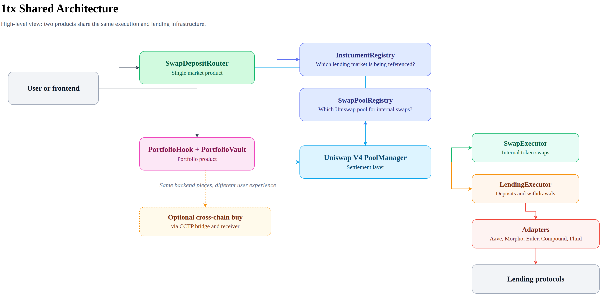
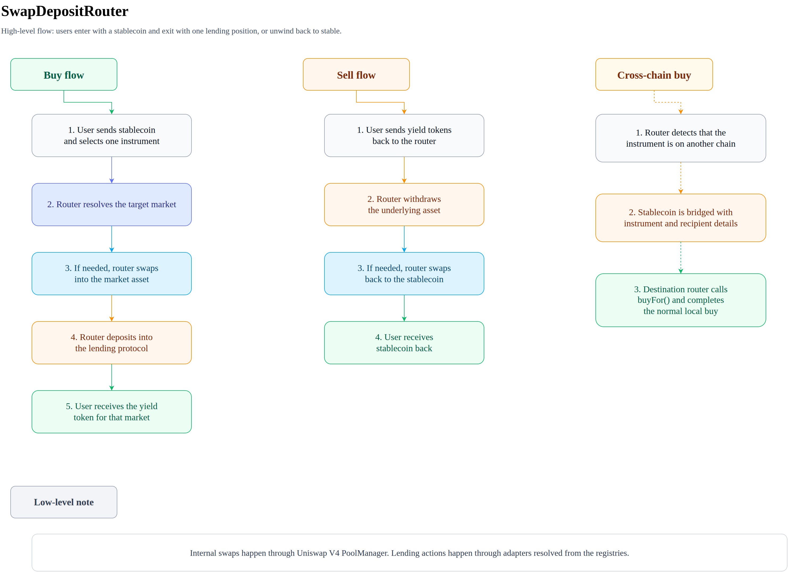

# 1tx Architecture

This document explains the product architecture in two layers:

- first, a high-level explanation for non-technical readers,
- then the lower-level contract and execution details.

## In plain English

1tx turns lending positions into swapable products.

Instead of asking users to learn each lending protocol, bridge tokens manually, swap into the right asset, and then deposit, 1tx packages that work into a swap experience that can be distributed through Uniswap V4.

The product is the `SwapDepositRouter`: buy or sell one lending position in one transaction.

At a business level, the idea is simple:

- users come with a stablecoin,
- 1tx handles any internal swaps and protocol interactions,
- users leave with a single yield position.

## What the product does

### Router product

The router is a simple, direct product.

A user says, in effect: "Take my stablecoin and put me into this specific lending market." The router handles the operational steps in the middle.

That means the router can:

- accept one stable input token,
- swap into the right market asset if needed,
- deposit into the selected lending protocol,
- return the protocol's yield token to the user,
- unwind the position back to stable on sell.

This is the fastest path for users who want a single yield position.

## Why Uniswap V4 matters

Uniswap is not just used for price execution here. It is also the distribution surface.

That matters because it means:

- users can access yield products from familiar swap interfaces,
- frontends do not need custom lending integrations for each protocol,
- a single execution engine can power lending-as-a-swap-product across chains.

In short: 1tx uses swap infrastructure as the entrypoint for yield products.

## Technical overview

The router is built from these execution building blocks:

- `InstrumentRegistry` resolves an `instrumentId` into `(adapter, marketId)`.
- `SwapPoolRegistry` resolves a directional token pair into the Uniswap V4 `PoolKey` used for internal swaps.
- `SwapExecutor` performs `poolManager.swap()` plus the required `sync`, `settle`, and `take` steps.
- `LendingExecutor` handles adapter approvals, deposits, and withdrawals.

### Design constraint

The router treats Uniswap V4 as the settlement layer for token movement and lending protocols as the yield layer.

`SwapDepositRouter` starts from a normal external call, so it must enter PoolManager context with `poolManager.unlock()` and finish swap work in `unlockCallback()`.

### Core contracts

- `src/SwapDepositRouter.sol`: user-facing router for single-instrument buy and sell flows.
- `src/registries/InstrumentRegistry.sol`: registry of globally unique instrument IDs.
- `src/registries/SwapPoolRegistry.sol`: registry of internal swap pools for directional token pairs.
- `src/libraries/SwapExecutor.sol`: reusable V4 swap settlement logic.
- `src/libraries/LendingExecutor.sol`: reusable adapter interaction logic.

## SwapDepositRouter details

`SwapDepositRouter` is the single-instrument path: the user chooses one instrument, pays in the configured stable token, and receives the protocol-specific yield token.

### Buy flow

1. The user calls `buy(instrumentId, amount, minDepositedAmount, ...)`.
2. The router resolves the instrument through `InstrumentRegistry`.
3. If the target market uses a different underlying token, the router gets the matching `PoolKey` from `SwapPoolRegistry`.
4. The router pulls stable tokens from the payer.
5. The router calls `poolManager.unlock(...)` and executes the swap inside `unlockCallback()` through `SwapExecutor`.
6. The router deposits the resulting market currency into the lending adapter through `LendingExecutor`.
7. The recipient receives the yield-bearing token directly.

If the market currency already matches the configured stable token, the swap step is skipped.

### Sell flow

1. The user calls `sell(instrumentId, yieldTokenAmount, minOutputAmount)`.
2. The router resolves the adapter and yield token for the instrument.
3. `LendingExecutor` pulls yield tokens from the user into the adapter and withdraws underlying assets back to the router.
4. If the withdrawn asset is not the configured stable token, the router swaps back through Uniswap V4.
5. The router transfers stable tokens to the user.

### Cross-chain buy path

For an `instrumentId` that belongs to another chain, `buy()` does not deposit locally:

1. The router extracts the chain ID from the instrument ID.
2. It transfers stable tokens to the configured CCTP bridge adapter.
3. The bridge carries `instrumentId`, recipient, and minimum output constraints in hook data.
4. On the destination chain, `CCTPReceiver` can call `buyFor(...)` so the local router finishes the normal buy flow for the intended recipient.

Current code supports cross-chain buys, but not cross-chain sells.

## Registries and adapters

The product depends on registry indirection so the user-facing API stays compact.

### InstrumentRegistry

- Stores `instrumentId -> {adapter, marketId}`.
- Encodes chain identity into the instrument ID so the router can detect local versus remote instruments.
- Lets the product stay protocol-agnostic while adapters carry protocol-specific logic.

### SwapPoolRegistry

- Stores directional `currencyIn -> currencyOut -> PoolKey` mappings.
- Must be configured in both directions for reversible flows.
- Decouples product logic from concrete Uniswap pool addresses and fee tiers.

### Adapters

Every lending protocol is wrapped behind `ILendingAdapter`, which keeps the product layer consistent across Aave, Morpho, Euler, Compound, and Fluid.

## Why the split matters

The architecture intentionally separates:

- the user entrypoint (`SwapDepositRouter`),
- routing metadata (`InstrumentRegistry`, `SwapPoolRegistry`),
- swap execution (`SwapExecutor`), and
- lending execution (`LendingExecutor`, adapters).

That keeps the execution layer minimal and reusable while leaving room to add new lending protocols or chains without churn at the user-facing layer.
